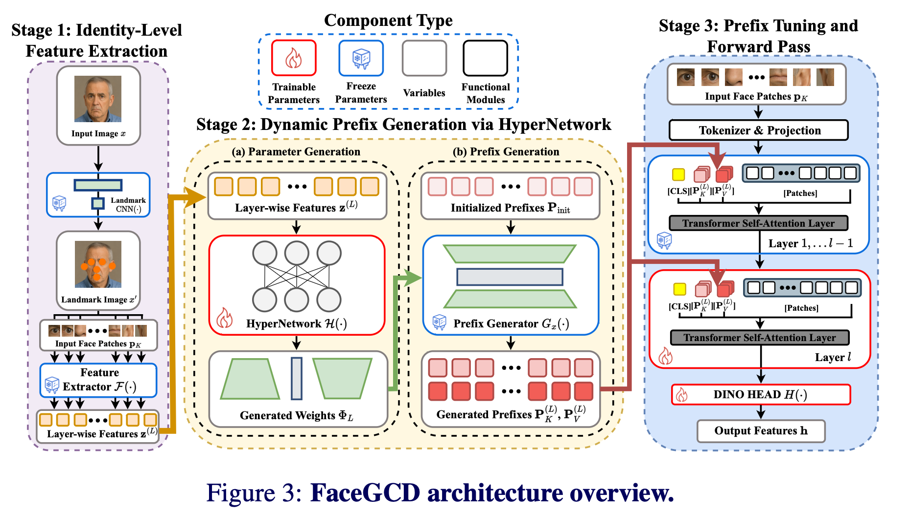
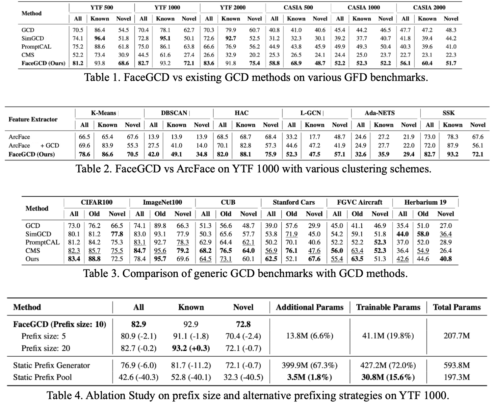

# FaceGCD: Generalized Face Discovery via Dynamic Prefix Generation [BMVC2025]

Official PyTorch implementation of **"FaceGCD: Generalized Face Discovery via Dynamic Prefix Generation"**.

📄 **Paper**: [arXiv:2507.22353](https://arxiv.org/pdf/2507.22353)

---

## 📋 Overview

Recognizing and differentiating among both familiar and unfamiliar faces is a critical capability for face recognition systems and a key step toward artificial general intelligence (AGI). This repository introduces **Generalized Face Discovery (GFD)**, a novel open-world face recognition task that unifies traditional face identification with generalized category discovery (GCD).

### Key Features

- **Novel Task**: GFD requires recognizing both labeled and unlabeled known identities (IDs) while simultaneously discovering new, previously unseen IDs
- **Dynamic Prefix Generation**: Instance-specific feature extractors using lightweight, layer-wise prefixes generated on-the-fly by a HyperNetwork
- **State-of-the-art Performance**: Significantly outperforms existing GCD methods and ArcFace baseline on fine-grained face recognition tasks
- **High Cardinality Support**: Handles hundreds or thousands of visually similar face IDs effectively

<p align="center">
  
</p>

---

## 🎯 Key Contributions

1. **Generalized Face Discovery (GFD)**: A new task formulation that bridges face identification and clustering in open-world scenarios
2. **Dynamic Prefix Mechanism**: HyperNetwork-based prefix generators that create instance-specific feature extractors without massive model capacity
3. **Comprehensive Benchmarks**: Six GFD benchmark datasets (YTF-500/1000/2000, CASIA-500/1000/2000)
4. **Strong Generalization**: Competitive performance on generic GCD benchmarks (CIFAR-100, ImageNet-100, CUB, etc.)

---

## 🚀 Installation

### Requirements

- Python 3.8+
- PyTorch 2.3.1+
- CUDA 11.8+
- APEX (for mixed precision training)

### Setup

1. Clone the repository:
```bash
git clone https://github.com/yourusername/FaceGCD.git
cd FaceGCD
```

2. Create a conda environment:
```bash
conda create -n facegcd python=3.8
conda activate facegcd
```

3. Install dependencies:
```bash
pip install -r requirements.txt
```

4. Install APEX (optional but recommended for faster training):
```bash
git clone https://github.com/NVIDIA/apex
cd apex
pip install -v --disable-pip-version-check --no-cache-dir --no-build-isolation --config-settings "--build-option=--cpp_ext" --config-settings "--build-option=--cuda_ext" ./
```

---

## 📊 Dataset Preparation

### GFD Benchmark Datasets

We provide six benchmark datasets for evaluating the Generalized Face Discovery task:

| Dataset | Known IDs | Unknown IDs | Train Samples | Test Samples |
|---------|-----------|-------------|---------------|--------------|
| YTF-500 | 250 | 250 | 48,089 | 11,779 |
| YTF-1000 | 500 | 500 | 96,002 | 23,523 |
| YTF-2000 | 1,000 | 1,000 | 190,248 | 46,615 |
| CASIA-500 | 250 | 250 | 46,991 | 11,999 |
| CASIA-1000 | 500 | 500 | 89,508 | 22,867 |
| CASIA-2000 | 1,000 | 1,000 | 184,432 | 47,114 |

### Download

**Datasets and pretrained checkpoints will be available soon via Google Drive.**

<!-- 
**Download links:**
- **Datasets**: [Google Drive Link - Coming Soon]
- **Pretrained Models**: [Google Drive Link - Coming Soon]
-->

Once downloaded, organize the data as follows:
```
FaceGCD/
├── youtube_faces_500/
│   ├── train/
│   └── test/
├── youtube_faces_1000/
│   ├── train/
│   └── test/
├── youtube_faces_2000/
│   ├── train/
│   └── test/
├── casia_webface_500/
│   ├── train/
│   └── test/
├── casia_webface_1000/
│   ├── train/
│   └── test/
└── casia_webface_2000/
    ├── train/
    └── test/
```

### Pretrained Weights

Download the DINO pretrained weights (`checkpoint.pth`) and place them in the project root directory.

---

## 🏋️ Training

### Train on YouTube Faces 1000

```bash
bash shell/train_youtube1000.sh
```

Or run directly:

```bash
CUDA_VISIBLE_DEVICES=0,1 torchrun \
    --nproc_per_node=2 \
    --master_port=55411 \
    train.py \
    --pretrained \
    --return-embed \
    --save-images \
    --pin-mem \
    --layer-embed \
    --experiment gcd_youtubefaces_1000_part_fvit_norm_prefix10 \
    --amp \
    --prefix_tuning \
    --prefix_length 10 \
    --data-path youtube_faces_1000 \
    --dataset youtubefaces_1000 \
    --amp-impl apex \
    --pretrained_weights checkpoint.pth \
    --log-wandb \
    --patch_size 8 \
    --input-size 3 112 112
```

### Key Training Arguments

- `--prefix_tuning`: Enable dynamic prefix generation
- `--prefix_length`: Number of prefix tokens (default: 10)
- `--dataset`: Choose from `youtubefaces_500`, `youtubefaces_1000`, `youtubefaces_2000`, `casia_500`, `casia_1000`, `casia_2000`
- `--data-path`: Path to dataset directory
- `--pretrained_weights`: Path to DINO pretrained checkpoint
- `--log-wandb`: Enable Weights & Biases logging
- `--amp`: Enable mixed precision training

### Training on Other Datasets

For CASIA-WebFace or different scales:

```bash
# CASIA-1000
python train.py \
    --dataset casia_1000 \
    --data-path casia_webface_1000 \
    --prefix_length 10 \
    --prefix_tuning \
    [other arguments...]

# YTF-500
python train.py \
    --dataset youtubefaces_500 \
    --data-path youtube_faces_500 \
    --prefix_length 10 \
    --prefix_tuning \
    [other arguments...]
```

---

## 🔍 Feature Extraction

After training, extract features for evaluation:

```bash
bash shell/feature_extract_youtube1000.sh
```

Or run directly:

```bash
CUDA_VISIBLE_DEVICES=0,1 torchrun \
    --nproc_per_node=2 \
    --master_port=25411 \
    extract_features.py \
    --pretrained \
    --return-embed \
    --save-images \
    --pin-mem \
    --experiment gcd_youtubefaces_1000_part_fvit_pretrain_prefix10 \
    --amp \
    --prefix_tuning \
    --prefix_length 10 \
    --data-path youtube_faces_1000 \
    --dataset youtubefaces_1000 \
    --amp-impl apex \
    --save_dir results \
    --landmark_cnn \
    --pretrained_weights checkpoint.pth \
    --checkpoint_weights model_best.pth.tar \
    --patch_size 8 \
    --input-size 3 112 112
```

This will save extracted features to the `results/` directory.

---

## 📈 Evaluation

Perform Semi-Supervised K-Means clustering on extracted features:

```bash
bash shell/semi_supervised_k_means_youtube1000.sh
```

Or run directly:

```bash
CUDA_VISIBLE_DEVICES=0,1 torchrun \
    --nproc_per_node=2 \
    --master_port=32411 \
    SSK.py \
    --experiment GCD_base_prefix_gen \
    --dataset youtubefaces_1000 \
    --K 1000 \
    --max_kmeans_iter 500 \
    --k_means_init 10 \
    --experiment_idx gcd_youtubefaces_1000_part_fvit_pretrain_prefix10 \
    --save_dir results \
    --data-path youtube_faces_1000
```

### Evaluation Metrics

- **ACC (Clustering Accuracy)**: Overall clustering accuracy

---

## 📊 Results

<p align="center">
  
</p>

---

## 🏗️ Project Structure

```
FaceGCD/
├── data_loader/              # Dataset loaders and augmentations
│   ├── augmentations/        # Data augmentation strategies
│   ├── youtube_faces_*.py    # YTF dataset loaders
│   ├── casia_webface_*.py    # CASIA dataset loaders
│   └── data_loaders.py       # Main data loading utilities
├── model/                    # Model architectures
│   ├── dino_vision_transformer.py  # DINO ViT backbone
│   ├── prefix_generator.py   # HyperNetwork-based prefix generator
│   ├── ViT_face.py           # Face-specific ViT components
│   └── mobilenet.py          # Landmark CNN
├── trainer/                  # Training utilities
│   ├── trainer.py            # Main training loop
│   └── faster_mix_k_means_pytorch.py  # Semi-supervised K-Means
├── utils/                    # Utility functions
│   ├── cluster_utils.py      # Clustering utilities
│   ├── losses.py             # Loss functions
│   └── dino_utils.py         # DINO-specific utilities
├── shell/                    # Shell scripts for experiments
├── train.py                  # Training script
├── extract_features.py       # Feature extraction script
├── SSK.py                    # Semi-supervised K-Means evaluation
└── requirements.txt          # Python dependencies
```

---

## 📝 Citation

If you find this work useful for your research, please cite:

```bibtex
@article{oh2025facegcd,
  title={FaceGCD: Generalized Face Discovery via Dynamic Prefix Generation},
  author={Oh, Yunseok and Choi, Dong-Wan},
  journal={arXiv preprint arXiv:2507.22353},
  year={2025}
}
```

---

## 🙏 Acknowledgments

This work is built upon several excellent projects:

- [DINO](https://github.com/facebookresearch/dino) - Self-supervised Vision Transformers
- [GCD](https://github.com/sgvaze/generalized-category-discovery) - Generalized Category Discovery
- [ArcFace](https://github.com/deepinsight/insightface) - Face Recognition baseline
- [timm](https://github.com/huggingface/pytorch-image-models) - PyTorch Image Models
- [APEX](https://github.com/NVIDIA/apex) - Mixed Precision Training

---

## 📧 Contact

For questions or issues, please:
- Open an issue on GitHub
- Contact: oys5339@inha.edu

---

## 📜 License

This project is released under the MIT License. See [LICENSE](LICENSE) file for details.

---

## 🔄 Updates

- **[2025-10]** Initial release of code and paper
- **[Coming Soon]** Pretrained models and datasets will be available via Google Drive

---

**Note**: This repository is actively maintained. Dataset and checkpoint download links will be updated once the upload to Google Drive is complete.
